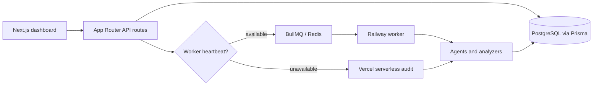

# Intelligence Report v2: current state

## Scope and status

This is a Phase 0 baseline. It describes the current implementation. It does not describe Intelligence Report v2 as implemented.

## Repository and application

SiteNexis is a pnpm and Turborepo monorepo. `apps/web` is a Next.js 15 App Router application using React 19, Tailwind, Radix UI, React Query, React Table, and Recharts. Shared contracts are in `packages/shared`; deterministic analysis is in `packages/analyzers`; external adapters are in `packages/adapters`; persistent access is in `packages/db`; crawling and queue support are in `packages/crawler`; agent orchestration is in `packages/agents`.

## Protected boundaries

Authentication uses Supabase server clients and middleware. `requireAuth` and dashboard/API ownership checks are protected. Billing uses plans, credit deduction, Stripe checkout/webhooks, and Layer 4 plan gating. Intelligence Report v2 must not alter these boundaries.

`POST /api/audit/start` is also protected. It validates a domain, applies rate limits, upserts the user, checks and deducts credits, creates the audit and agent manifest, then chooses worker or serverless execution.

## Audit execution

### Worker path

The BullMQ worker in `packages/crawler/src/worker.ts` requires a Redis heartbeat and executes `runInfrastructureAgent`. The worker has concurrency 5, three queue attempts, exponential backoff, and a 10-minute job lock. The infrastructure agent runs crawl first, then parallel analysis phases: SEO/schema/governance/Scout; retrieval/entity/performance; citation/semantic trust/information gain; then Layer 4 agents when plan access permits. It persists scores and report artifacts before completing the audit.

### Serverless path

`apps/web/src/lib/serverless-audit.ts` is the Vercel fallback. It is fetch-first, limits the crawl to 50 pages, and has a 270-second budget. It computes many deterministic and heuristic equivalents internally, persists partial outputs where possible, and marks the audit partial on budget expiry. Optional providers must not fail the audit.

## Crawl and extraction

The worker crawler uses Puppeteer, robots, sitemap discovery, batch crawling, and rendered DOM extraction. The serverless path uses `FetchExtractionAdapter` for static HTML. When `CRAWL4AI_URL` is configured, it can use a rendered Crawl4AI service and retry bounded CSR-shell candidates.

Current pages store requested URL, normalized URL, final URL, headings, canonical evidence, body text, content hash, extraction mode, and extraction confidence. They do not preserve a full raw and rendered snapshot pair for the same page. This is a v2 extension requirement, not a reason to change the current crawler now.

## Persistence and scoring

Core models are `Audit`, `Page`, `Issue`, `AuditScore`, and `Report`. Supporting models persist AI visibility, entities, chunks, retrieval simulations, machine trust, temporal authority, recommendation surfaces, AI governance, RedLab, Scout, SII, SSE, graphs, Google data, and LoopOS state.

SEO uses an explicit 100-point normalized deduction model. AI Visibility is a weighted composite of machine readability, entity confidence, retrieval readiness, citation probability, semantic trust, and schema. Serverless overall score weights SEO 25%, AI visibility 40%, schema 15%, and link/performance 20%. The worker computes a broader average. Current audits do not persist a scoring, report, evidence, or crawler methodology version.

## Reports and exports

Existing outputs include the audit report, narrative report, executive summary, Machine Resource Studio, Fix Plan, Decision Roadmap, Issues Center, page intelligence, CSV export, and PDF report artifacts. Narrative and executive summaries are generated on demand with cache and provider fallbacks. MRS is deterministic and consumes stored pages, issues, and scores; it is not a second scoring engine.

## Providers

Current integrations include Supabase, PostgreSQL/Prisma, Redis/BullMQ, Vercel, Railway, Crawl4AI, Groq, OpenRouter, OpenAI, Anthropic, Google OAuth/GA4/Search Console/GTM, Serper, Stripe, and Resend. Backlink-provider totals are not currently available from Ahrefs, Semrush, Moz, or Majestic.

## Worker and serverless differences

| Concern | Worker | Serverless | Consequence |
| --- | --- | --- | --- |
| Crawl | Puppeteer, up to 500 pages | Fetch-first, up to 50 pages | Coverage is not directly comparable |
| Rendered evidence | Native | Crawl4AI only when configured | Rendering confidence differs |
| Agent graph | Full orchestrated phases | Internal equivalent and partial modules | Outputs can differ |
| PDF | Reporting agent | Not identical | Report availability differs |
| Time budget | Background job | 270 seconds | Serverless can be partial |

## Historical compatibility risks

Existing rows may lack newer provenance fields. Existing `AuditScore.breakdown` consumers, audit IDs, report URLs, CSV/PDF contracts, worker queue behavior, Supabase ownership checks, billing credits, and Layer 4 gating must remain compatible. V2 must be append-only and must not silently recalculate historical scores.
