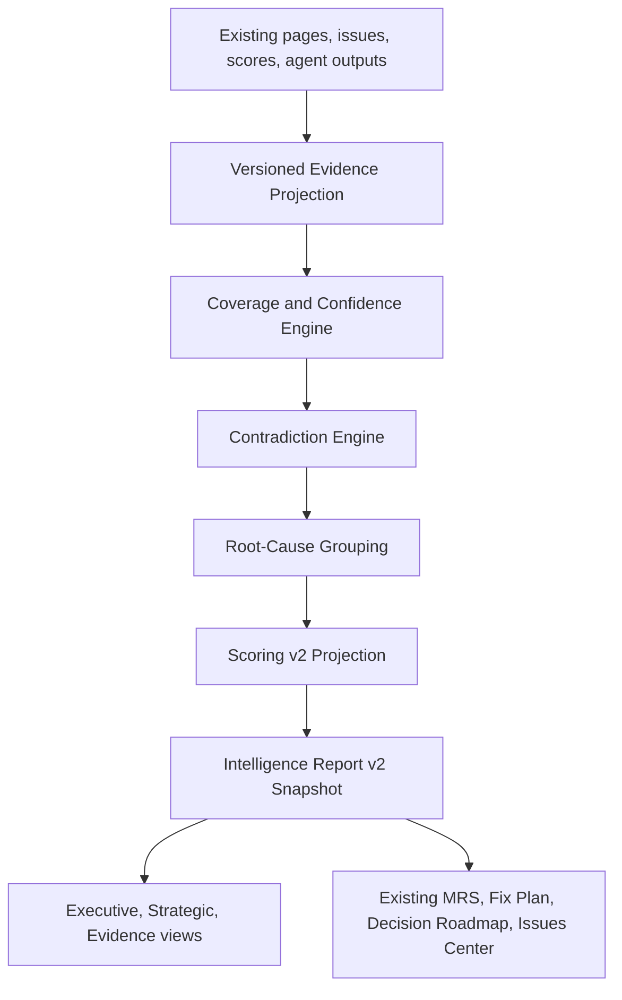

# Intelligence Report v2: additive architecture plan

## Contract

Intelligence Report v2 is a synthesis and projection layer. It does not replace the audit engine, Page, Issue, AuditScore, MRS, Fix Plan, Decision Roadmap, Entity Intelligence, Entity Authenticity, Citation Intelligence, Link Graph, or Recommendation Surfaces. It consumes, normalizes, and projects their existing evidence.

## Ownership and reuse matrix

| Capability | Current owner | Stored output | v2 role | Modification rule |
| --- | --- | --- | --- | --- |
| Crawl, robots, sitemap | crawler/adapters | Page and crawl signals | project evidence | avoid changing in early phases |
| Raw/rendered extraction | fetch, Crawl4AI, Puppeteer | Page extraction fields | source-layer projection | extend later, preserve behavior |
| SEO/schema | analyzers and agents | Issue, AuditScore | normalize findings | reuse |
| Entities/authenticity | entity, synthetic entity agents | Entity and related records | classify consistency/authenticity | reuse |
| Citations/information gain | citation engines and agents | scores and result records | distinguish readiness/authority | reuse |
| Retrieval/trust/governance/RedLab | existing engines | dedicated score/report records | evidence inputs | reuse |
| Link/perception/temporal/surfaces | existing engines | graph and score records | evidence inputs | reuse |
| Fix Plan/Roadmap/Issues Center | analyzers/dashboard | issue and recommendation outputs | receive v2 references | do not duplicate |
| MRS/reporting/exports | MRS, reporting agent, API routes | report and export artifacts | render v2 projection through adapters | preserve v1 |

## Future phases

1. Version metadata and evidence primitives.
2. Coverage, confidence, source layer, and verification-state projection.
3. Raw/rendered and retry evidence adapters.
4. Contradictions and root-cause grouping.
5. Transparent scoring v2 projection.
6. Existing-module synthesis, narrative inputs, and recommendation integration.
7. Versioned views and additive exports.
8. Historical guards, Crestscape regression, parity tests, and controlled rollout.

## Compatibility and rollout

V1 remains the default. Existing audits remain v1 and are never silently recalculated. Selected new audits may receive an optional v2 projection. V2 generation must be non-blocking: audit completion succeeds if v2 fails. A future per-audit report-version selection is sufficient until a dedicated flag system is deliberately approved. Disablement hides or bypasses v2 while retaining v1 and additive evidence records.

## Phase 2 proposal only

Phase 2 is limited to shared contracts and additive persistence design: version metadata, evidence projection primitives, verification states, source layers, coverage, and confidence. Likely files: `packages/shared/src/*`, `packages/db/schema.prisma`, `packages/db/src/queries/*`, and focused tests. Protected files: audit start route, auth, middleware, credits/plans, crawler, worker, serverless runner, current score engines, exports, and report UI. Any Prisma addition must be nullable/defaulted and require a separate migration review.
